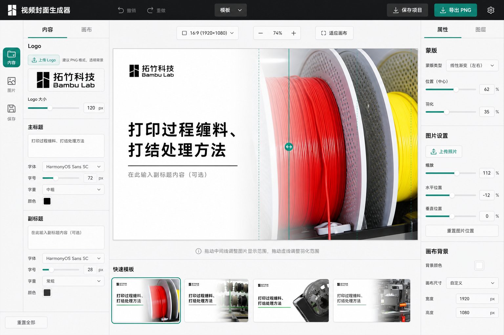

# Voice Cover Image

一个专门为中文视频教程、产品说明和知识类短视频设计的封面生成器。

它把“左侧清晰标题 + 右侧产品照片 + 柔和羽化过渡”这套高点击率封面版式做成了一个浏览器工具。上传照片，改标题，拖一下蒙版，直接导出 `1920 x 1080` PNG。

> 如果你也经常为了视频封面反复打开设计软件，这个项目可以帮你把那一步变成 30 秒。觉得有用的话，欢迎给一个 Star。

[在线体验 Cloudflare Pages](https://voice-cover-image.pages.dev/) · [备用 GitHub Pages](https://yinbaozong.github.io/Voice-cover-image/) · [查看源码](https://github.com/yinbaozong/Voice-cover-image)



## 适合谁

- 做产品教程、维修教程、知识讲解、软件教学视频的人。
- 想快速批量做统一风格封面的内容创作者。
- 想把封面生成流程放到本地浏览器里，不上传图片到服务器的人。
- 想继续二次开发一个垂直封面工具、模板工具或内部运营工具的开发者。

## 功能亮点

- `1920 x 1080` 标准视频封面画布。
- 左侧标题区、右侧照片区、中央线性羽化蒙版。
- 支持上传照片和 Logo。
- 内置中文 Logo 和英文 Logo，常用品牌不用反复上传。
- 支持主标题、副标题编辑。
- 主标题可切换加粗，避免每张封面都手调字重。
- 主标题不自动乱换行，只按用户输入的换行显示。
- 横线粗细、文字组位置、标题和横线间距可调。
- 一键把标题、横线、副标题整组垂直居中。
- 照片可在画布上直接拖动，滚轮缩放。
- 支持照片旋转、亮度、阴影、饱和度、对比度调整。
- 蒙版中心和羽化宽度可直接在画布上拖动。
- 导出 PNG 时不会带辅助线。
- 图片处理全部在浏览器本地完成，不需要后端服务。

## 30 秒开始使用

先确认电脑已经安装 Node.js，然后在 PowerShell 里进入项目目录：

```powershell
cd E:\opai\Voice-cover-image
```

安装依赖：

```powershell
npm install
```

启动开发服务器：

```powershell
npm run dev -- --port 5173
```

浏览器打开：

```text
http://127.0.0.1:5173/
```

## 怎么做一张封面

1. 点击 `上传照片`，选择右侧要展示的产品图、截图或实拍图。
2. 点击 `上传 Logo`，选择品牌 Logo。推荐透明 PNG，也支持常见图片格式。
3. 在左侧输入主标题和副标题。
4. 用 `加粗` 按钮决定主标题是否加粗。
5. 在画布上拖动照片，滚轮缩放照片。
6. 拖动蒙版圆点调整照片进入文字区的位置。
7. 拖动两侧羽化线调整过渡柔和程度。
8. 在右侧调整旋转、亮度、阴影、饱和度、对比度。
9. 点击右上角 `导出 PNG`。

导出的图片固定为：

```text
1920 x 1080
```

## 生成静态 HTML

这个项目是 React + Vite 应用。你可以把它构建成一份静态 HTML 站点：

```powershell
npm run html
```

或者：

```powershell
npm run build
```

构建结果会出现在：

```text
dist/
```

`dist/index.html` 就是最终入口，旁边的 `assets/` 和 `fonts/` 目录是它需要的资源。把整个 `dist/` 文件夹上传到任意静态托管服务即可运行，例如 GitHub Pages、Netlify、Vercel、公司内网静态服务器等。

注意：`dist/` 是“静态站点文件夹”，不要只单独复制 `index.html`，需要连同 `assets/`、`fonts/` 一起分享。

## 生成本地单文件版

如果你想发给朋友一个可以本地打开的 HTML 文件，运行：

```powershell
npm run local
```

生成结果：

```text
local-html/Voice-Cover-Image.html
```

这个文件已经内联了 JS、CSS 和字体。朋友不需要安装 Node.js，也不需要部署服务器，直接用 Chrome 或 Edge 打开即可使用。

如果某些浏览器因为安全策略限制 `file://` 页面运行，请改用 Chrome / Edge，或让对方使用在线版：

```text
https://voice-cover-image.pages.dev/
https://yinbaozong.github.io/Voice-cover-image/
```

## GitHub Pages

仓库里已经包含 GitHub Pages 自动部署工作流：

```text
.github/workflows/pages.yml
```

推送到 `main` 分支后，GitHub Actions 会自动：

1. 安装依赖。
2. 执行 `npm run build`。
3. 上传 `dist/`。
4. 部署到 GitHub Pages。

默认访问地址：

```text
https://yinbaozong.github.io/Voice-cover-image/
```

如果第一次部署没有立刻出现，请到 GitHub 仓库的 `Settings -> Pages` 确认 Source 选择为 `GitHub Actions`。

GitHub Pages 是 GitHub 给仓库提供的静态网页托管服务。它只托管 HTML、CSS、JS、图片、字体这类静态文件，不运行后端程序。这个项目的在线版挂在 `yinbaozong.github.io/Voice-cover-image/` 下面，不是单独占用一个新域名，而是使用 GitHub 的二级域名和仓库路径。

## 项目结构

```text
Voice-cover-image
├─ .github/workflows/       GitHub Pages 自动部署
├─ docs/                    说明图、设计参考
├─ scripts/                 构建脚本，例如本地单文件 HTML
├─ public/                  静态资源，目前放 HarmonyOS 字体
├─ src/                     核心源码
│  ├─ App.jsx               编辑器界面、交互、状态管理
│  ├─ assets/               内置 Logo 图片
│  ├─ coverRenderer.js      Canvas 封面渲染引擎
│  ├─ main.jsx              React 入口
│  └─ styles.css            应用样式
├─ index.html               Vite HTML 入口
├─ package.json             命令和依赖
├─ package-lock.json        依赖锁定文件
├─ vite.config.js           Vite 配置，使用相对路径方便静态部署
└─ README.md                项目说明
```

## 核心模块怎么分工

### `src/App.jsx`

编辑器的“大脑”。如果你要改操作方式、按钮、面板、上传、导出、拖拽交互，优先看这里。

主要负责：

- 管理当前封面设置 `settings`。
- 上传照片和 Logo。
- 编辑主标题、副标题。
- 处理画布上的照片拖动、缩放、蒙版拖动、羽化线拖动。
- 调用 `renderCover()` 更新预览。
- 调用 `canvas.toBlob()` 导出 PNG。
- 把设置自动保存到 `localStorage`。

### `src/coverRenderer.js`

最终封面的“渲染引擎”。如果你要改导出的封面长什么样，优先看这里。

主要负责：

- 定义画布尺寸 `1920 x 1080`。
- 定义默认配置 `defaultSettings`。
- 绘制背景、Logo、照片、蒙版、标题、横线、副标题。
- 处理照片亮度、阴影、饱和度、对比度。
- 保证预览和导出使用同一套渲染逻辑。

### `src/styles.css`

编辑器 UI 的视觉样式。按钮、面板、辅助线、移动端布局都在这里。

### `public/fonts/`

内置 HarmonyOS Sans SC 字体，让没有安装对应字体的电脑也能尽量保持标题效果一致。

字体文件会增加仓库体积。如果你二次开发时不需要固定中文字体，可以替换为系统字体或其他可商用字体。

## 核心配置字段

默认配置位于 `src/coverRenderer.js` 的 `defaultSettings`：

```js
{
  title,
  subtitle,
  subtitleEnabled,
  titleSize,
  subtitleSize,
  titleBold,
  titleX,
  titleY,
  textMaxWidth,
  lineThickness,
  textGap,
  logoSize,
  logoX,
  logoY,
  maskPosition,
  feather,
  imageScale,
  imageOffsetX,
  imageOffsetY,
  imageRotation,
  imageBrightness,
  imageShadows,
  imageSaturation,
  imageContrast,
  imageOpacity,
  background,
  foreground,
  muted,
  accent
}
```

常见二开入口：

- 改默认标题：`defaultSettings.title`
- 改默认副标题：`defaultSettings.subtitle`
- 改是否默认启用副标题和横线：`defaultSettings.subtitleEnabled`
- 改标题位置：`defaultSettings.titleX` / `defaultSettings.titleY`
- 改标题字号：`defaultSettings.titleSize`
- 改标题是否默认加粗：`defaultSettings.titleBold`
- 改横线粗细：`defaultSettings.lineThickness`
- 改标题和横线距离：`defaultSettings.textGap`
- 改 Logo 位置：`defaultSettings.logoX` / `defaultSettings.logoY`
- 改蒙版位置：`defaultSettings.maskPosition`
- 改羽化宽度：`defaultSettings.feather`
- 改字体：`FONT_FAMILY`

## 二次开发路线

### 想多加几个封面模板

建议从 `src/coverRenderer.js` 入手，把 `drawTextBlock()`、`drawLogo()`、`drawMaskedImage()` 抽成模板可切换的函数。

可以新增：

- 科技产品模板
- 课程封面模板
- 维修教程模板
- 直播预告模板
- 横版/竖版比例切换

### 想加颜色和字体选择

建议在 `src/App.jsx` 增加控件，然后把值写进 `settings`。渲染时在 `src/coverRenderer.js` 使用这些字段。

适合新增的字段：

- `foreground`
- `muted`
- `background`
- `fontFamily`
- `titleWeight`
- `lineColor`

### 想做批量生成

建议新增一个 CSV/Excel 导入模块，把每一行标题、副标题、图片路径映射成一组 `settings`，然后循环调用 `renderCover()` 导出。

### 想做真正的单文件 HTML

可以继续加一个构建脚本：

```text
npm run build:single
```

目标输出：

```text
release/voice-cover-image.html
```

实现方向：

- 把构建后的 JS 内联到 HTML。
- 把 CSS 内联到 HTML。
- 把字体转成 base64 内联。
- 保留本地上传和 PNG 导出能力。

这样朋友不需要安装 Node.js，也不需要部署服务器，直接打开一个 HTML 文件就能用。

## 给下一个 AI 开发者的上下文

请先读这三个文件：

```text
src/coverRenderer.js
src/App.jsx
src/styles.css
```

推荐理解顺序：

1. 先读 `src/coverRenderer.js`，确认最终导出的 PNG 是怎么画出来的。
2. 再读 `src/App.jsx`，确认每个控件怎么修改 `settings`。
3. 最后读 `src/styles.css`，确认编辑器界面和辅助线怎么显示。

几个不要破坏的原则：

- 预览和导出必须共用 `renderCover()`。
- 辅助线只能出现在编辑器 DOM 上，不能画进最终 PNG。
- 上传图片只在浏览器本地处理，不上传服务器。
- 主标题不要自动按宽度换行，只按用户输入的换行符换行。
- 新增状态字段时，要同步更新 `defaultSettings` 和 `normalizeSettings()`。
- 不要提交 `node_modules/` 和 `dist/`。

## 常用命令

```powershell
# 安装依赖
npm install

# 本地开发
npm run dev -- --port 5173

# 构建静态 HTML 站点
npm run html

# 构建本地单文件 HTML
npm run local

# 预览生产构建
npm run preview -- --port 4173
```

## 隐私说明

这个工具不需要后端。照片、Logo、标题和调色参数都在浏览器本地处理。除非你自己把导出的 PNG 或项目部署到外部平台，否则工具不会主动上传你的图片。

## Star

如果这个项目帮你少开一次设计软件、少调一次封面模板，欢迎点 Star。它会继续往“更适合中文视频创作者的一键封面工具”方向迭代。
